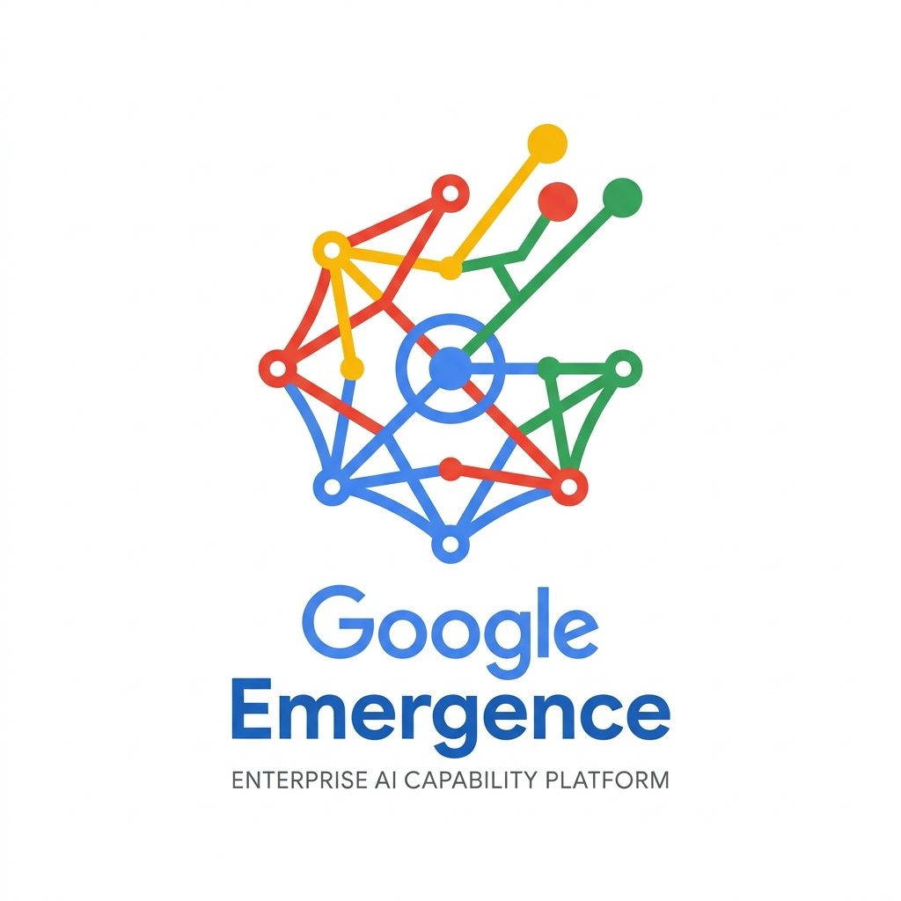
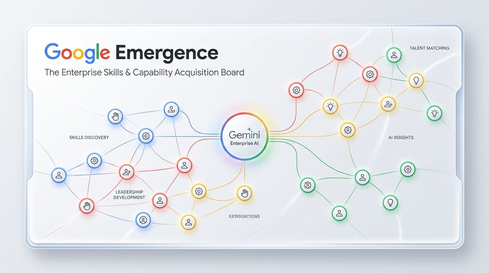
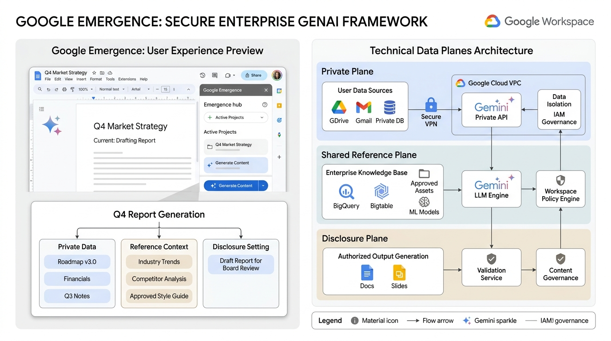

<div align="center">



# Google Emergence
### The Enterprise Skills & Capability Acquisition Board

**A living capability map connecting everyday enterprise work in Google Workspace and Gemini Enterprise to strategic capability development, verified demonstration evidence, and accelerated human emergence.**

[](LICENSE)
[](docs/QA.md)
[](package.json)
[](docs/ARCHITECTURE.md)

[Executive Proposal](docs/PROPOSAL.md) · [Enterprise Architecture](docs/ARCHITECTURE.md) · [Responsible AI & Evaluation](docs/EVALUATION.md) · [Grant of Rights to Google LLC](docs/PERMISSION.md) · [Verification Record](docs/QA.md)

</div>

---

<div align="center">
  
</div>

## 1. Executive Vision: Accelerating Human Capability

In the era of generative AI, enterprise value does not come merely from generating draft text or boilerplate code faster. It comes from **empowering human talent to master complex systems, lead cross-functional initiatives, and innovate with genuine conviction**.

Traditional enterprise tools treat talent either as static résumés or through passive, punitive surveillance. **Google Emergence** introduces a new paradigm: a **human-centered capability acceleration platform** native to the Google ecosystem.

```text
Enterprise Strategic Priority → Relevant Capability Possibility → Google Workspace Sprint
       ↑                                                                   ↓
Capability Passport ← Human-Verified Evidence Review ← Inspectable Work Product (Docs/Code)
       ↕
Standardized Rubrics, Contextual Enterprise Benchmarks, and Google Engineering Perspectives
```

### Key Differentiators:
- **The Living Actor:** A private, employee-owned digital capability passport that evolves continuously through authentic work products rather than self-reported claims.
- **Dual-Mode Assistance Isolation:** Explicitly separates **Independent Human Mastery** from **Gemini Enterprise Collaboration**. Enterprises need employees who understand foundational principles *and* know how to wield frontier AI tools with high leverage.
- **Google Workspace Native:** Growth projects take form as 15, 30, or 60 minute sprints in Google Docs, Sheets, and Slides.
- **BeyondCorp Zero-Trust Governance:** Built for Google Cloud VPC Service Controls (VPC-SC) and Customer Managed Encryption Keys (CMEK). Zero keystroke logging, zero emotion recognition, and zero automated employment sorting.

---

## 2. Interactive Enterprise Surfaces

| Surface | Enterprise Experience |
|---|---|
| **Emergence Constellation** | Interactive network mapping 6 core enterprise capabilities (Systems Architecture, Research Judgment, Executive Storytelling, Rapid Prototyping, Inclusive Facilitation, Applied GenAI). Toggle between Independent and Gemini-Assisted modes. |
| **Growth Projects** | Launch structured sprints with clear hypotheses, time budgets, practice steps (Frame, Make, Reflect), and exportable Gemini Gem playbooks. |
| **Perspectives Library** | Adopt tested working methodologies from Google SRE, Google Workspace Narrative Labs, and Enterprise Culture. Adopting a methodology initiates practice without inflating scores. |
| **Shared Horizons** | Contextualize capabilities against synthetic enterprise benchmarks (Global Enterprise, Google Cloud Partners). Small groups ($N < 30$) are strictly withheld to protect psychological safety. |
| **Evidence Library** | Review candidate demonstration records. Evidence updates capability scores *only* upon explicit human verification and acceptance. |
| **Data & Sovereignty** | Granular controls to disconnect enterprise sources with immediate exclusion propagation, export selective capability passports, or reset local state. |
| **System Proposal** | Full executive proposal and technical architecture specifications for Google Cloud and Google Workspace leadership. |

---

## 3. Technical Architecture & Security Data Planes

<div align="center">
  
</div>

Google Emergence is structured across three isolated data planes:

1. **Private Employee Plane (Customer VPC / CMEK):** Contains raw Google Docs work products, reflections, and personal learning records. Encrypted with customer-managed Cloud KMS keys.
2. **Shared Reference Plane (Google Cloud Enterprise Domain):** Hosts versioned capability rubrics, differential privacy benchmarks ($k \ge 30$), and Vertex AI evaluation pipelines.
3. **Disclosure Plane (Capability Passport):** Generates cryptographically verifiable, selective capability claims (mean rubric score, demonstration count, assistance mode) for organizational mobility, omitting private reflections.

---

## 4. Requirements & Quickstart

- **Runtime:** Node.js 22 or newer.
- **Browser:** Any modern web browser with ES modules and native HTML5 dialog support.
- **Dependencies:** **Zero external NPM runtime dependencies**. Uses native Node.js test runner and HTTP server.

### Local Development

```bash
# Clone the repository
git clone https://github.com/bohselecta/google-skills-aquisition-board.git
cd google-skills-aquisition-board

# Verify domain logic and build assets
npm run check

# Start the local development server
npm run dev
```

Navigate to `http://127.0.0.1:4173`. The development server operates strictly in loopback mode with zero external network transmission.

### Portable Standalone Distribution

```bash
npm run build
```

This compiles a zero-dependency, self-contained single-file application into **`dist/google-emergence.html`**. You can open this file directly in any web browser completely offline.

---

## 5. Five-Minute Executive Walkthrough

1. **Explore Perspectives:** Navigate to **Perspectives** and open *The Systems Architect* (Google SRE lens). Review the three core practices, select them, and initiate a growth project.
2. **Execute a Growth Project:** In **Growth Projects**, complete the three verification steps (Frame, Make, Reflect) and run *Simulate Demonstration Review*.
3. **Verify Evidence:** Open the **Evidence Library**. Review the proposed demonstration record, inspect the standardized rubric criteria, and click **Accept Demonstration**.
4. **Inspect the Constellation:** Return to the **Emergence Board**. Notice how your *Systems Architecture* capability recalculates its mean score based on verified evidence.
5. **Test Assistance Modes:** Toggle between **Independent Human** and **With Gemini Enterprise** to observe how unassisted human mastery and AI-augmented execution are tracked as distinct, isolated proficiencies.
6. **Data Sovereignty:** In **Data & Privacy**, disconnect *Google Workspace & Drive*. Return to the constellation: affected capabilities immediately display as **Unmapped**—demonstrating real-time permission revocation.

---

## 6. Comprehensive Documentation Index

| Specification | Description |
|---|---|
| [PROPOSAL.md](docs/PROPOSAL.md) | The executive product proposal, enterprise thesis, and Google Workspace integration roadmap. |
| [ARCHITECTURE.md](docs/ARCHITECTURE.md) | Technical data planes, VPC-SC boundaries, schemas, Vertex AI pipelines, and IAM integration. |
| [EVALUATION.md](docs/EVALUATION.md) | Google Responsible AI Principles alignment, psychometric validity, and anti-surveillance policies. |
| [PROVENANCE.md](docs/PROVENANCE.md) | Conceptual lineage from the Living Actor framework into Google Enterprise AI. |
| [PERMISSION.md](docs/PERMISSION.md) | Formal, irrevocable grant of rights and permissions to Google LLC and Alphabet Inc. |
| [ACCEPTANCE.md](docs/ACCEPTANCE.md) | Acceptance criteria, verified functional capabilities, and technical handoff status. |
| [QA.md](docs/QA.md) | Automated domain test execution logs and verification proofs. |
| [AGENTS.md](AGENTS.md) | Frozen product invariants and instructions for autonomous coding agents and maintainers. |

---

## 7. License & Special Grant to Google LLC

Google Emergence is published under the **Apache License 2.0**, with a dedicated **Special Adaptation & Integration Grant for Google LLC** set forth in [LICENSE](LICENSE) and [PERMISSION.md](docs/PERMISSION.md). 

Google LLC, its subsidiaries, and successors are granted **full, perpetual, royalty-free, and irrevocable permission** to adapt, rebrand, commercialize, and integrate this software into **Google Workspace, Gemini Enterprise, Vertex AI, and Google Cloud Platform**.

---

<div align="center">
  <b>Google Emergence</b> · An Independent Contribution by <b>Hayden Lindley</b> · September 30, 2026<br>
  <i>Empowering human emergence in the age of intelligence.</i>
</div>
